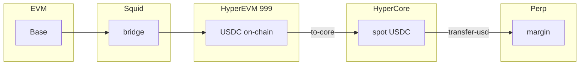
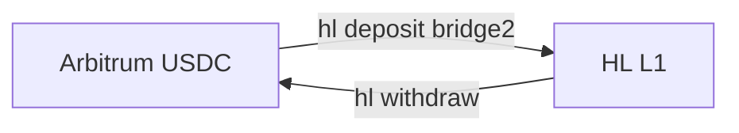

# Speed OS — agentic documentation (maximum reference)

This document is the **authoritative guide** for AI agents operating **Lightspeed Speed OS** (Chromium extension in `speed-os-extension/`). It unifies **multi-skill routing**, **dual-surface CLI usage** (intent field vs ⌘K terminal), **UI and settings**, **suggestions**, **installation**, **MCP**, **external agent access** (browser automation, Anthropic Computer use, Claude Code), and **command reference**.

---

## Table of contents

1. [How agents access Speed OS and the intent field](#how-agents-access-speed-os-and-the-intent-field-read-this-first)
2. [Critical rule — two surfaces](#critical-rule--two-surfaces-never-mix-syntax)
3. [Part I — Skill tree (0–13)](#part-i--skill-tree-narrative)
4. [Extension runtime contract](#extension-runtime-contract)
5. [Intent keyword and phrase reference](#intent-keyword-and-phrase-reference)
6. [Intent suggestion system](#intent-suggestion-system)
7. [Full UI map](#full-ui-map)
8. [Settings](#settings-appearance-mcp-wallet)
9. [Installation and license](#installation-distribution-and-license)
10. [External agents: Claude, Claude Code, automation](#external-agents-claude-computer-use-claude-code-browser-automation)
11. [MCP server](#mcp-server)
12. [Per-command quick reference](#per-command-quick-reference-all-bundled-commands)
13. [Nested `speed … help` index](#nested-speed--help-index)
14. [Hyperliquid: flows, matrix, parity](#hyperliquid-flows-matrix-parity)
15. [Bridge and chain vocabulary](#bridge-and-chain-vocabulary)
16. [Ownership boundaries and responsibility model](#ownership-boundaries-and-responsibility-model)
17. [Failure classification taxonomy](#failure-classification-taxonomy)
18. [Canonical state reconciliation procedure](#canonical-state-reconciliation-procedure)
19. [Observability and debug capture standard](#observability-and-debug-capture-standard)
20. [Identity, SANS, XP](#identity-sans-and-xp)
21. [Fund-safety playbook](#fund-safety-playbook)
22. [Keyboard, panels, activity](#keyboard-panels-and-activity)
23. [Skill route mapping](#skill-route-mapping)
24. [Troubleshooting](#troubleshooting)
25. [Source files (maintainers)](#source-files-maintainers)

---

## How agents access Speed OS and the intent field (read this first)

Speed OS is a **Manifest V3** extension. It **replaces the new tab page** (`chrome_url_overrides.newtab` → `index.html` in `public/manifest.json`). There is **no public HTTPS website** for the app; it runs as a **privileged extension page**.

### Reaching the UI

| Entry | What to do |
|-------|------------|
| **New tab** | With Speed OS installed and enabled, open a **new tab** (e.g. **Ctrl+T** / **Cmd+T**). |
| **Direct URL** | `chrome://extensions` or `brave://extensions` → Developer mode → copy **Extension ID** → open `chrome-extension://<id>/index.html`. |
| **Install** | From repo: `npm install` / `npm run build` in `speed-os-extension`, **Load unpacked** → `dist/`. Releases: [lightspeedfoundation/speed-os](https://github.com/lightspeedfoundation/speed-os). If a `.crx` is published, you may drag it onto the extensions page with Developer mode on; **Chromium often restricts** unsigned third-party CRX — **Load unpacked** remains the reliable dev path. |

### Intent field (DOM)

- **Selectors:** `input.intent-input`, `input[name="intent"]`
- **Form:** `form.intent-form` — **Enter** submits.
- **No** REST/WebSocket API fills this field. **MCP** merges **env** into the in-page runtime; it does **not** remote-control the DOM.

### Automated access (ranked)

1. **Browser automation (Playwright / Puppeteer / Selenium + CDP):** attach to a profile with Speed OS → navigate to new tab or `chrome-extension://…/index.html` → `fill` / `type` → **Enter**. For **swap** / **bridge**, wait for the **Confirm** card and quote, then confirm (path uses `runConfirmIntent` which prepends `--yes`).
2. **[Anthropic Computer use](https://docs.anthropic.com/en/docs/build-with-claude/computer-use):** screenshot + mouse + keyboard on a desktop; open browser → new tab → click intent → type → Enter. No special Chrome API. Follow Anthropic security guidance (VM isolation, prompt injection).
3. **Human-in-the-loop:** exact line to paste.

### What does *not* drive the intent field

| Mechanism | Notes |
|-----------|--------|
| **Claude Code / terminal agents** | No first-party “connect to my extension” socket. Use **CLI `speed`** elsewhere or **browser automation** / **user** for the UI. |
| **MCP** | Env merge for commands running **inside** the extension; not DOM control. |
| **⌘K terminal** | Separate surface — raw argv only (see below). |

### Suggestions as templates

Rows under the intent field **replace** the input text on click (`setInput(sug.text)`). Automation can click the row or set the value to the same string. **Not shown** in the ⌘K terminal.

### Wallet

Most commands need an **unlocked** vault. **Before** the wallet check, `runSpeedWithVault` returns: **`speed skill`** text, **curated `speed <cmd> help`** (intent help), and paths matching **`--help` / `-h`** or **`speed config get`** without a key. Otherwise: `Unlock wallet to run speed commands.`

---

## Critical rule — two surfaces, never mix syntax

| Surface | Location | Interpretation |
|---------|----------|----------------|
| **A — Intent field** | Center “Ask Speed” | `normalizeIntentLineForCli`: spoken keywords, `@TICKER`, bridge/HL phrases; lines with `--` mostly pass through. |
| **B — ⌘K terminal** | Overlay / pinned “Terminal · speed-cli” | `parseSpeedLine` only: real flags (`--json`, `-a`, `-y`). **No** spoken normalization. |

---

## Part I — Skill tree (narrative)

### Skill 0 — Orientation

**Layers:** EVM (Base `8453`, Arbitrum `42161`, …) → **Hyperliquid L1** (perp + spot API) → **HyperEVM** `999` (on-chain after Squid).

**Bundled commands:** `allowance`, `approve`, `balance`, `bridge`, `config`, `dca`, `doctor`, `estimate`, `gas`, `history`, `hl`, `identity`, `pending`, `price`, `quote`, `revoke`, `sans`, `send`, `skill`, `status`, `swap`, `volume`, `whoami`, `xp`.

**Embedded guide:** `speed skill` (intent or terminal).

### Skill 1 — Wallet and MCP

- `speed whoami` / `speed doctor` / `speed doctor chain base`
- K: `speed -c base doctor`
- One trading key across HL and chains; unlock to sign. MCP default `https://mcp.ispeed.pro`; vault `PRIVATE_KEY` is not overwritten by MCP env.

### Skill 2 — Portfolio and pending

Intent: `speed balance`, `speed balance json`, `speed pending json`, `speed history json`  
K: `speed --json balance`, `speed pending --json`, `speed history --json --limit 10`

### Skill 3 — Swaps

Intent: `speed quote pay eth receive usdc amount 0.01`; `speed swap pay eth receive speed amount 0.05`; add `yes`, `dry run`  
K: `speed quote --sell ETH --buy USDC -a 0.01 -c base`; `speed swap … -y`

### Skill 4 — Bridge (Squid)

Intent long: `speed bridge amount 100 from token speed to chain ethereum`  
Shorthand: `speed bridge 50 from base to arbitrum`; `speed bridge 10 base hyperliquid usdc` (optional trailing `hype`)  
K: explicit `--from-chain`, `--to-chain`, `--from-token`, `--to-token`, `-a`  
Verify: `speed status`, `speed pending json`

### Skill 5 — Send

Intent: `speed send to 0x… amount 0.01 token eth`  
K: CLI flags for `--to`, `-a`, `--token`, `-c`

### Skill 6 — HL reads

`speed hl setup`, `speed hl positions json`, `speed hl spot json` — prefer **`speed --json hl setup`** in K for automation.

### Skill 7 — Arbitrum ↔ HL (bridge2 / withdraw3)

Deposit: `speed hl deposit 10 yes` — min **5** USDC Arbitrum.  
Withdraw: `speed hl withdraw 100 yes` — optional `--to` on K.

### Skill 8 — Base ↔ HL via Squid + HyperEVM

Bridge e.g. `speed bridge 25 base hyperliquid usdc` → then `speed hl to core usdc all` or `speed hl to-core usdc --all -y`.

### Skill 9 — Spot ↔ perp

`speed hl transfer usdc all to perp` / `speed hl transfer-usd --all --to-perp -y`

### Skill 10 — Composites

`speed hl evm to perp all` / `speed hl perp to evm 25 yes`

### Skill 11 — Perp trade

`speed hl open BTC long 0.01 yes` / `speed hl close BTC yes`

### Skill 12 — Gas and approvals

`speed gas chain base amount 0.02`; `speed approve …`; `speed allowance …`

### Skill 13 — Identity and SANS (detail in [dedicated section](#identity-sans-and-xp))

Use `speed identity help`, `speed sans help`, nested keys in [Nested help index](#nested-speed--help-index).

---

## Extension runtime contract

**Order of operations in `runSpeedWithVault`:** (1) `speed skill` → print extension guide. (2) **`speed <cmd> help`** / argv ending in `help` → `getIntentExtensionHelpText` curated text. (3) **`canRunSpeedWithoutWallet`:** args contain `--help` or `-h`, **or** `config` + `get`. (4) Else require unlocked vault with `PRIVATE_KEY`. (5) `runSpeedBrowser`.

**Intent submit (`store.ts`):**

- **Swap / bridge lines** open a **Confirm** card (quote preview). Submit calls **`runConfirmIntent`**, which builds argv from **`normalizeIntentLineForCli`**, then runs **`runSpeedWithVault(["--yes", ...args])`** — confirmation skip for that flow.
- **Other lines** use **`runIntentSpeedCli`**: same normalization, **no** auto `--yes` unless the user typed `yes` (→ `-y`).

**K terminal:** no normalization; user supplies flags. Quick chips e.g. `whoami`, `doctor`, `--json balance`.

---

## Intent keyword and phrase reference

Spoken tokens are expanded in order: `@` aliases → portfolio pay/receive → price phrases → `pay`/`receive` → bridge phrases → bridge chain-pair shorthands → **HL spoken phrases** → `expandKeywordOptions`.

### `expandKeywordOptions` (intent → argv)

| Spoken | Flag |
|--------|------|
| `from token X` | `--from-token X` |
| `from chain X` | `--from-chain X` |
| `to token X` | `--to-token X` |
| `to chain X` | `--to-chain X` |
| `amount N` | `-a N` |
| `chain N` | `-c N` |
| `token X` | `--token X` |
| `spender X` | `--spender X` |
| `to 0x…` (after send) | `--to 0x…` |
| `limit P` | `--limit P` |
| `leverage N` | `--leverage N` |
| `isolated` | `--isolated` |
| `unwrap` | `--unwrap` |
| `dry run` | `--dry-run` |
| `ops N` | `--ops N` |
| `interval T` | `--interval T` |
| `count N` | `--count N` |
| `skill path` | `--path` (after `skill`) |
| `status … tx 0x…` | `--tx 0x…` |
| `help` | `--help` |
| `json` | `--json` |
| `yes` | `-y` |
| `go` | `--go` |

**Swap / quote:** `pay X` → `--sell X`, `receive Y` → `--buy Y`.

**Price:** `price oracle` → `price`; `price token 0x…` → `price 0x…`.

**Bridge:** `bridge N from A to B` (with optional `eth|usdc|speed` token) → `-a` + chains + tokens. **Chain pair:** `bridge <amt> C1 C2 usdc [hype]` or token/amount permutations — see `expandBridgeChainPairTokens` in `main-view-cli-aliases.ts`.

**HL (no `--` in line):** e.g. `hl to core usdc all` → `hl to-core usdc --all -y`; `hl transfer usdc all to perp` → `hl transfer-usd --all --to-perp -y`; `hl evm to perp all` → `hl evm-to-perp --all -y`; amount variants with `yes` → `-y`. If the line already contains `--`, HL rewrites are skipped where applicable.

---

## Intent suggestion system

- **Pipeline:** `getSuggestionsFromParts` → `buildIntentSuggestions` + contextual generators → **`rankSuggestions`** → cap **`SUGGESTION_DISPLAY_CAP` (18)** (`suggestions/index.ts`).
- **Sources:** `COMMAND_EXAMPLE` per command, **intent-engine** schema patterns (swap, bridge, quote, send, estimate), bridge chain hints, saved `@` aliases, portfolio symbols/balances, **frequency model** / **last action** / execution recording (`frequency-model.ts`, `last-action.ts`).
- **UI:** Clicking a suggestion sets **`sug.text`** into the intent input — use as a **template**, edit amounts/tokens, then Enter.
- **⌘K terminal** has **no** suggestion list.

---

## Full UI map

| Region | Access | Role |
|--------|--------|------|
| **Top bar** | Always | Brand, gas, MCP host label, copy trading address, lock, **Settings (gear)** |
| **Ambient backdrop** | Main stage | Video/image (settings); frosted area over intent |
| **HlPositionsPanel** | Main stage (collapsible via dock **H**) | HL snapshot, refresh, hide, USD spot↔perp actions, **open** / **close** forms (same signing stack as `speed hl`) |
| **Intent block** | Center | Main input + suggestions + inline result |
| **Bottom dock** | Always | **P** Portfolio, **A** Activity, **T** Tokens, **H** Hyperliquid (if vault unlocked); toggles are mutually exclusive for panels |
| **Slide panels** | Dock | **Agent portfolio:** total USD, rows by chain, JSON toggle, spam-filter hints. **Activity:** intent runs, ok/err, BaseScan link if tx hash extracted. **Saved tokens:** `@TICKER` list (Base), remove |
| **Terminal** | **⌘/Ctrl+K**, **/**, **Esc** | Overlay or **Pin split**; scrollback; Refresh MCP |
| **Settings** | Gear | See next section |

---

## Settings (appearance, MCP, wallet)

From `SettingsPanel.tsx` / storage modules:

| Section | Details |
|---------|---------|
| **Appearance** | Default: bundled `public/assets/default.mp4`. **Custom:** PNG, JPEG, GIF, WebP, MP4 up to **5 MB** (`MAX_CUSTOM_BG_BYTES`). **Does not** apply to ⌘K terminal chrome (per UI copy). |
| **Color theme** | IDs: `degen`, `hacker`, `trader`, `n00b`, `pepe`, `toshi`, `stealth`, `rich` — main view, slide panels, wallet gate, terminal chrome; **not** the background media. |
| **Font** | IDs: `default` (IBM Plex), `georgia`, `comic-sans`, `open-sans`, `montserrat`, `nunito`, `space-grotesk`, `dm-sans`, `outfit`, `plus-jakarta-sans` — UI sans; code uses **IBM Plex Mono**. |
| **MCP** | URL field (default `https://mcp.ispeed.pro`), **Save MCP & refresh** → `saveMcpUrl` + `initSpeedRuntime`. |
| **Wallet backup** | Vault password → reveal **private key** and optional **mnemonic** (`exportWalletSecrets`); never share. |

---

## Installation, distribution, and license

- **Upstream:** [lightspeedfoundation/speed-os](https://github.com/lightspeedfoundation/speed-os).
- **From source:** `npm run build` → Load unpacked `dist/`.
- **CRX:** If Releases ship a `.crx`, use Developer mode; if drag-and-drop is blocked, use unpacked `dist/`.
- **License:** Speed OS and related Lightspeed OSS are intended to be used under **GPLv3** copyleft terms as published by the project — **convey source**, **license**, and **modifications** per GPLv3 when you distribute derivatives. Confirm the exact text at [LICENSE](https://github.com/lightspeedfoundation/speed-os/blob/main/LICENSE) on the canonical repo (local clones may vary).

---

## External agents: Claude Computer use, Claude Code, browser automation

- **Computer use:** [Anthropic docs](https://docs.anthropic.com/en/docs/build-with-claude/computer-use) — desktop automation; can operate Chrome and Speed OS visually.
- **Claude Code / IDE:** No proprietary extension bridge. Patterns: **user steps**, **CLI `speed` + MCP** on a dev host, **Playwright/Puppeteer/CDP** (`--remote-debugging-port`) against a profile with Speed OS, or **Computer use** where integrated.
- **Direct page URL:** `chrome-extension://<id>/index.html` after reading **ID** from `chrome://extensions`.

---

## MCP server

- **Default:** `https://mcp.ispeed.pro` — RSA key in extension storage, Streamable HTTP env fetch (`mcp-client`), merge via `loadMcpEnvAndMerge` in `prepareSpeedRuntimeForCli` / runtime init.
- **Vault wins:** `PRIVATE_KEY` from the vault is applied to env and **not** overwritten by MCP.
- **Service keys:** Third-party API keys used by CLI commands (e.g. OpenSea-related env for SANS) are expected to arrive **through MCP merged env** when the server is configured — the MCP implementation is **open source** and may be **self-hosted** to serve **multiple agents** or tenants; point the extension to your server in Settings.
- **Terminal:** **Refresh MCP** button re-inits runtime.

---

## Per-command quick reference (all bundled commands)

Alphabetical per `bundled-commands.ts`. **Intent** = example; **K** = argv style. Full prose: `speed <cmd> help` (intent) or Commander `--help` (K).

| Command | Intent example | K terminal |
|---------|----------------|------------|
| `allowance` | `speed allowance chain base token 0x… spender 0x…` | `speed allowance --token … --spender … -c base` |
| `approve` | `speed approve chain base token 0x… spender 0x… amount max` | explicit flags |
| `balance` | `speed balance json` | `speed --json balance` |
| `bridge` | `speed bridge 50 from base to arbitrum` | `--from-chain` / `--to-chain` / `-a` / tokens |
| `config` | `speed config get json` | `speed config get` |
| `dca` | `speed dca chain base amount 0.001 interval 5m count 3` | per CLI |
| `doctor` | `speed doctor` | `speed doctor` |
| `estimate` | `speed estimate swap pay eth receive usdc amount 0.01` | per CLI |
| `gas` | `speed gas chain base amount 0.01` | per CLI |
| `history` | `speed history json limit 10` | `speed history --json --limit 10` |
| `hl` | `speed hl setup` | `speed --json hl setup` |
| `identity` | `speed identity register myagent.speed` | per subcommand |
| `pending` | `speed pending json` | `speed pending --json` |
| `price` | `speed price chain base` | `speed price -c base` |
| `quote` | `speed quote pay eth receive usdc amount 0.01` | `--sell` / `--buy` / `-a` |
| `revoke` | `speed revoke chain base token 0x… spender 0x…` | per CLI |
| `sans` | `speed sans listings json` | per subcommand |
| `send` | `speed send to 0x… amount 0.01 token eth` | `--to` / `-a` / `--token` |
| `skill` | `speed skill` | `speed skill` |
| `status` | `speed status tx 0x… chain base` | `--tx` / `-c` |
| `swap` | `speed swap chain base pay eth receive usdc amount 0.01` | `--sell` / `--buy` / `-a` / `-y` |
| `volume` | `speed volume chain base amount 0.001 ops 5` | per CLI |
| `whoami` | `speed whoami` | `speed whoami` |
| `xp` | `speed xp json` | `speed xp --json` |

---

## Nested `speed … help` index

Curated in `intent-extension-help.ts` — use **`speed <nested> help`** in the **intent field** (normalized to `--help`).

| Key | Topic |
|-----|--------|
| `config:get` / `config:set` | Preferences |
| `hl:positions` / `hl:open` / `hl:close` / `hl:spot` / `hl:setup` | HL subcommands |
| `hl:to-core` / `hl:transfer-usd` / `hl:evm-to-perp` / `hl:perp-to-evm` / `hl:deposit` / `hl:withdraw` | Flows |
| `identity:register` / `set-resolve` / `set-favorite-token` / `profile:get` / `profile:set` / `community:set-fee` / `community:set` | .speed identity |
| `sans:listings` / `owned` / `buy` / `list` / `unlist` / `transfer` / `offers` / `offer` / `accept-offer` / `cancel-offer` | SANS |

---

## Hyperliquid: flows, matrix, parity

### Flow diagrams





### `hl` subcommands (`hl.ts`)

| Subcommand | Role |
|------------|------|
| `deposit` | Arbitrum USDC → HL (min 5) |
| `withdraw` | HL → Arbitrum |
| `positions` | Perps + margin; JSON + spot + `cliHints` |
| `spot` | Core spot balances |
| `setup` | Combined JSON + `suggestToCoreUsdcAll`, `suggestTransferUsdToPerp`, … |
| `to-core` | HyperEVM → Core spot (USDC / HYPE) |
| `transfer-usd` | Spot ↔ perp USDC |
| `evm-to-perp` | One-shot HyperEVM → perp |
| `perp-to-evm` | One-shot perp → HyperEVM USDC |
| `open` / `close` | Perp orders |

### Parity vs Starchild / `hl_*` tools

See [openclaw/skills/hyperliquid/SKILL.md](../../openclaw/skills/hyperliquid/SKILL.md). **`speed hl`** does not offer full parity: e.g. no TP/SL helpers in CLI, no Starchild `hl_order` tool surface — use JSON **`speed --json hl positions`** and **`hl setup`** for automation.

---

## Bridge and chain vocabulary

`bridge-chain-hints.ts` **WORD_TO_CANON** includes: `ethereum`/`eth`/`mainnet`, `base`, `optimism`/`op`, `arbitrum`/`arb`, `polygon`/`matic`, `bnb`/`bsc`, `hyperliquid`/`hyperevm`/`hl`.

**Swap:** 0x routes on **supported chain IDs** only (`swap-chain-eligible.ts` + `@speed-cli/constants`); **999** is not a generic 0x swap surface like Base.

---

## Ownership boundaries and responsibility model

Agents need an explicit model for **who owns each stage** and **who can remediate** failures.

### Runtime domains

| Domain | Primary owner | Typical failures | Primary remediation |
|--------|----------------|------------------|---------------------|
| **Speed OS UI (extension tab)** | User + extension runtime | Input mistakes, locked vault, stale UI state | Correct command, unlock wallet, rerun |
| **Source chain execution** | User wallet + source chain RPC/mempool | Insufficient funds/gas, nonce, revert | Fix wallet/funds/args, resend |
| **Routing/quote layer** | 0x / Squid APIs | No route, stale quote, API timeout | Requote, change size/token/chain |
| **Relayer/bridge pipeline** | Bridge provider infra | Relay delay, message pending | Wait/poll status; escalate to provider |
| **Destination chain execution** | Destination chain + bridge executor | Destination revert, execution delay | Poll status; if failed, provider support flow |
| **HL API state/indexing** | Hyperliquid services | Index lag, temporary mismatch vs chain | Re-query after delay, compare with chain-level hints |
| **MCP env distribution** | MCP operator/self-host | Missing keys/env merge issues | Verify MCP URL, refresh runtime, inspect MCP logs |

### Bridge stage ownership (canonical)

| Stage | Owner | Observable artifact | Agent question answered |
|-------|-------|----------------------|-------------------------|
| Source tx submission | User wallet + source chain | Source tx hash | "Did user transaction actually submit?" |
| Route planning | Squid/0x router | Route/quote ID | "Was there a valid route?" |
| Relay / message passing | Relayer/provider | Request/status id | "Is this delayed or failed in transit?" |
| Destination execution | Destination chain / executor | Destination tx hash (when available) | "Did final leg execute?" |
| Post-bridge indexing | Portfolio/index APIs | `balance`, `pending`, `status` views | "Is this just lag, or truly missing funds?" |

This model prevents generic "bridge broke" responses and forces agents to identify the failing stage.

---

## Failure classification taxonomy

Use these classes in all incident responses so remediation is deterministic.

| Class | Meaning | Fast signals | First action |
|------|---------|--------------|--------------|
| `USER_INPUT` | Wrong amount/token/chain/flags | Commander validation or obvious arg mismatch | Correct command and rerun |
| `WALLET_LOCKED` | Vault key unavailable | `Unlock wallet to run speed commands.` | Unlock wallet, re-run |
| `FUNDS_OR_GAS` | Balance/allowance/gas insufficient | Revert text, allowance errors, low native | Refill gas / approve / resize |
| `RPC_TRANSPORT` | RPC unreachable/timeout | Network timeout, provider errors | Retry + switch/check RPC path |
| `QUOTE_OR_ROUTE` | 0x/Squid cannot produce route | Quote preview failure / no route | Requote, alter token pair/size/chain |
| `SOURCE_REVERT` | Source-chain tx failed | On-chain revert / failed receipt | Decode reason, patch params |
| `RELAYER_DELAY` | Bridge submitted but in-flight | `pending`/`status` not finalized | Poll with backoff; no duplicate send |
| `DESTINATION_EXECUTION` | Relay reached destination but exec failed | Status indicates destination failure | Escalate provider flow; preserve IDs |
| `INDEXING_LAG` | Backend/API lag vs true state | Chain/HL state disagree temporarily | Wait and re-query in canonical order |
| `UNKNOWN` | Not enough data yet | Missing tx/route/status IDs | Collect observability payload first |

Severity guidance:

- `P0`: funds at risk/unknown destination after expected finality window.
- `P1`: submitted funds, delayed settlement, recoverable with monitoring.
- `P2`: deterministic local/user error, no cross-domain uncertainty.

---

## Canonical state reconciliation procedure

When funds appear missing, always follow this order. Do not skip stages.

1. **Context lock**  
   Capture wallet (`speed whoami`), command line used, timestamp, and intended route.
2. **Source of truth snapshot**  
   Run `speed balance json`, `speed pending json`, and (for HL flows) `speed --json hl setup`.
3. **Source tx verification**  
   Confirm source-chain tx hash exists and has receipt/finality.
4. **Route/status verification**  
   Check `speed status ...` with bridge request/quote ID and tx hash where supported.
5. **Destination settlement check**  
   Validate destination-chain balance/state (`balance chain ...`, `hl spot`, `hl positions`).
6. **Domain-specific follow-up**  
   - HyperEVM landed but perp empty: `hl to-core` then `hl transfer-usd --to-perp`.
   - Arbitrum/HL bridge path: confirm deposit/withdraw stage completion.
7. **Classify failure**  
   Assign taxonomy class from section above (`RELAYER_DELAY`, `INDEXING_LAG`, etc.).
8. **Escalate with evidence**  
   If unresolved, hand off full observability packet (next section) to provider/operator.

Rule: agents should avoid duplicate submissions while status is unresolved unless explicitly instructed.

---

## Observability and debug capture standard

Every non-trivial execution should capture this minimum payload for reproducibility.

### Required fields

- `timestamp_utc`
- `wallet_address`
- `surface` (`intent` or `k_terminal`)
- `raw_input_line`
- `normalized_argv` (if intent)
- `chain_context` (source/destination if bridge)
- `command_family` (`swap`, `bridge`, `hl`, etc.)
- `quote_or_route_id` (if available)
- `source_tx_hash` (if available)
- `destination_tx_hash` (if available)
- `status_poll_samples` (id + status + timestamp)
- `balances_before` and `balances_after`
- `hl_setup_snapshot` / `hl_positions_snapshot` for HL flows
- `stderr_or_error_text` (exact)

### Recommended capture points

1. **Before submit**: balances + intent/argv
2. **After submit**: tx hash / request ID
3. **During pending**: periodic status samples
4. **After settle**: destination balances and HL state

Minimal JSON skeleton:

```json
{
  "timestamp_utc": "2026-04-08T00:00:00Z",
  "wallet_address": "0x...",
  "surface": "intent",
  "raw_input_line": "speed bridge 25 base hyperliquid usdc",
  "normalized_argv": ["bridge", "-a", "25", "--from-chain", "base", "--to-chain", "hyperliquid", "--from-token", "usdc", "--to-token", "usdc"],
  "source_tx_hash": "0x...",
  "route_id": "…",
  "classification": "RELAYER_DELAY"
}
```

---

## Identity, SANS, and XP

### `speed identity` (Base, ERC-8004 .speed)

Subcommands: `register`, `set-resolve`, `set-favorite-token`, `profile` (get/set), `community` (set-fee, set). Examples: `speed identity register myagent.speed`, `speed identity profile get myagent.speed json`. Nested help keys: `identity:*` in `intent-extension-help.ts`.

### `speed sans` (OpenSea, Base)

Subcommands: `listings`, `owned`, `buy`, `list`, `unlist`, `transfer`, `offers`, `offer`, `accept-offer`, `cancel-offer`. Env keys for OpenSea rate limits / writes are expected **via MCP** when the MCP server provides them — no separate manual key section required for agents using default MCP.

### `speed xp`

Read-only XP / streak: `speed xp json`; optional `no title` per help.

---

## Fund-safety playbook

1. `speed whoami`
2. `speed balance json` + `speed --json hl setup`
3. Base→HL: `bridge` → `hl to-core` if USDC on 999 → `hl transfer-usd … --to-perp` if trading perps
4. Arbitrum path: `hl deposit` / `hl withdraw`
5. After txs: `pending`, `history`, `status`
6. Before perps: `hl positions` + spot; margin > 0 or transfer from spot

---

## Keyboard, panels, and activity

| Key | Action |
|-----|--------|
| **⌘/Ctrl+K** | Toggle terminal |
| **/** | Open terminal (when focus not in an input) |
| **Esc** | Close terminal |
| **P** / **A** / **T** | Portfolio / Activity / Saved tokens |
| **H** | Hyperliquid panel (unlocked) |

Successful intent runs can **peek** Activity (`openActivityPeek`) and send a **notification** (where supported).

---

## Skill route mapping

| Route | Intent | K terminal |
|-------|--------|----------|
| Snapshot | `speed hl setup`, `speed balance json` | `speed --json hl setup`, `speed --json balance` |
| Base → HL | `speed bridge … base hyperliquid usdc` | `speed bridge -a … --from-chain base --to-chain hyperliquid …` |
| Arb → HL | `speed hl deposit 10 yes` | `speed hl deposit 10 -y` |
| HL → Arb | `speed hl withdraw 50 yes` | `speed hl withdraw 50 -y` |
| HyperEVM → Core | `speed hl to core usdc all` | `speed hl to-core usdc --all -y` |
| Spot → perp | `speed hl transfer usdc all to perp` | `speed hl transfer-usd --all --to-perp -y` |
| EVM→perp | `speed hl evm to perp all` | `speed hl evm-to-perp --all -y` |
| Perp→EVM | `speed hl perp to evm 25 yes` | `speed hl perp-to-evm 25 -y` |

---

## Troubleshooting

- **Unlock wallet** — most commands fail fast with `Unlock wallet to run speed commands.` except help / `speed skill` / `config get` / `--help`.
- **HL “does not exist” / mismatch** — `speed whoami` must match the HL trading address; fund via app or `hl deposit` / bridges (`hl.ts` hints).
- **Stuck USDC** — run `speed --json hl setup`, then `speed hl spot`, `speed hl positions`; trace Squid vs Arbitrum vs HyperEVM with `pending` / `status`.
- **Swap/bridge confirm** — wait for quote; if `quoteLoading`, Enter may no-op until ready.

---

## Source files (maintainers)

| Concern | Path |
|---------|------|
| Intent DOM | `src/newtab/App.tsx` (`IntentBlock`) |
| Normalization | `src/lib/main-view-cli-aliases.ts` |
| Intent store / confirm | `src/newtab/store.ts` |
| Vault + MCP gate | `src/lib/run-speed-with-vault.ts` |
| K terminal | `src/newtab/components/TerminalPanel.tsx` |
| Help text | `src/lib/intent-extension-help.ts` |
| Skill print | `src/lib/speed-skill-extension-guide.ts` |
| Suggestions | `src/lib/intent-suggestions.ts`, `src/lib/suggestions/*.ts` |
| Commands | `src/lib/bundled-commands.ts`, `src/lib/command-examples.ts` |
| Manifest | `public/manifest.json` |
| HL CLI | `src/commands/hl.ts` (parent repo) |

---

*CLI behavior is authoritative if this doc and Commander diverge. Prefer `speed <cmd> help` (intent) or `speed <cmd> --help` (K terminal / desktop).*
